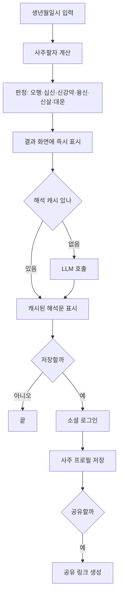

# 01. 서비스 개요

> saju-ai 는 생년월일시로 사주를 계산해 보여주고, 그 결과가 무엇을 뜻하는지 AI 가 풀어 설명하는 서비스다.
> 이 문서는 서비스가 무엇인지, 사용자가 어떤 순서로 쓰는지, 그리고 도메인 용어를 정의한다.

## 1. 무엇을 만드는가

생년월일시를 입력하면 사주팔자를 뽑고 오행 분포, 십신, 신강약, 용신, 신살, 대운을 판정한다.
판정은 코드가 결정론적으로 내린다. 같은 입력에는 항상 같은 판정이 나온다.

그 판정 결과를 LLM 에 넘겨 "이것이 어떤 의미인지"를 문장으로 풀게 한다.
LLM 은 계산하지 않는다. 계산은 이미 끝난 상태로 넘어간다.

이 분리가 서비스의 핵심이다.
근거를 제시할 수 있고, 결과가 매번 달라지지 않으며, 같은 사주의 해석을 캐싱할 수 있다.
자세한 배경은 [ADR 0005](adr/0005-rule-engine-plus-llm-interpretation.md) 에 있다.

## 2. 무엇을 만들지 않는가

- 채팅 상담. 해석문을 보여주는 것까지가 범위다.
- 궁합, 택일, 작명. MVP 에 넣지 않는다.
- 유료 결제. MVP 에 넣지 않는다.
- 네이티브 모바일 화면. 앱은 웹을 감싼 셸이다([ADR 0002](adr/0002-tanstack-start-capacitor-shell.md)).

## 3. 사용자 흐름

계산과 판정은 클라이언트에서 실행되므로 네트워크 없이도 D 단계까지 도달한다
([ADR 0003](adr/0003-spa-bundle-for-app.md)).
로그인은 저장과 공유 시점에만 요구한다([ADR 0008](adr/0008-social-login-server-storage.md)).

## 4. 화면

| 화면 | 하는 일 | 로그인 |
| ---- | ------- | ------ |
| 입력 | 생년월일시, 성별, 출생지(경도), 계산 옵션 입력 | 불필요 |
| 결과 | 사주팔자, 오행, 십신, 신강약, 용신, 신살, 대운, 해석문 | 불필요 |
| 내 사주 | 저장한 사주 목록과 공유 링크 관리 | 필요 |
| 공유 | 공유 링크로 열리는 읽기 전용 결과 화면 | 불필요 |
| 설정 | 야자시 정책 등 계산 옵션 기본값 | 불필요 |

## 5. 계산 옵션

유파가 갈리는 지점은 단일 정답을 강요하지 않고 옵션으로 제공한다.

적용한 값은 결과 화면에 표시하지 않는다. 옵션을 고를 수단이 아직 없어 넷 다
기본값으로 고정되기 때문이다. 설정 지면이 붙어 값이 갈리기 시작하면 다시 정한다.
계산 결과에는 그대로 담는다. 해석 캐시 키가 계산 옵션을 포함한다.

| 옵션 | 코드 이름 | 기본값 | 갈리는 이유 |
| ---- | --------- | ------ | ----------- |
| 야자시 정책 | `ziPolicy` | 정자시설 | 23시 이후 출생의 일주 귀속이 정자시설과 야자시설로 갈린다 |
| 서머타임 기록 성격 | `dstAssumption` | 모름 | 기록이 서머타임 시계인지 환산한 것인지 알 수 없는 경우가 많다 |
| 모호한 벽시계 해석 | `ambiguityChoice` | 이른 쪽 | 시계를 되돌린 날은 같은 벽시계가 두 번 존재한다 |
| 지원 세력 범위 | `supportIncludesResource` | 비겁 + 인성 | 득령·득지·득시를 비겁만으로 좁히는 유파가 있다 |

상세 규칙은 [`05-saju-domain-rules.md`](05-saju-domain-rules.md) 를 따른다.

### 5.1 경고 문구

계산이 가정을 하나라도 세웠으면 결과 화면이 그 사실을 말한다.
엔진이 `TimeNotice` 로 내고 화면이 아래 문구로 옮긴다.

| notice | 언제 나오는가 | 문구 |
| ------ | ------------- | ---- |
| `local-mean-time` | 1908년 4월 이전 출생 | 표준시가 없던 시기라 지방 평균시로 계산했습니다 |
| `non-standard-offset` | 표준시가 UTC+9 가 아니던 시기 | 당시 표준시로 읽었습니다 |
| `daylight-unwound` | 서머타임 시행 구간 | 서머타임 시계로 보고 한 시간을 되돌렸습니다 |
| `dst-assumption-unknown` | 서머타임 구간인데 기록 성격이 모름 | 기록이 서머타임 시계인지 확인되지 않아 그대로 가정했습니다 |
| `ambiguous-wall-clock` | 그 벽시계가 두 번 존재 | 이 시각은 두 번 존재합니다 |
| `nonexistent-wall-clock` | 그 벽시계가 존재하지 않음 | 이 시각은 존재하지 않아 전환 직후로 옮겼습니다 |
| `true-solar-fallback` | 출생지 경도를 모름 | 출생지를 몰라 서울 기준으로 보정했습니다 |

문구는 사실만 적는다. 사용자가 잘못 입력했다는 뜻으로 읽히게 쓰지 않는다.
대부분은 그 시대에 태어났다는 것 말고 아무 잘못이 없다.

우리가 고른 것과 사용자가 고른 것을 구분한다.
`ambiguous-wall-clock` 은 어느 쪽을 골랐는지와 함께 기본값인지를 밝히고,
고르지 않은 쪽의 시각도 같이 보여준다. 근거는 [05](05-saju-domain-rules.md) 7.4 다.

야자시 경계(보정 후 23:00~24:00)에서는 두 일주를 함께 보여준다.
경고가 아니라 답이 둘인 경우다. 근거는 [05](05-saju-domain-rules.md) 6장이다.

## 6. 용어집

문서와 코드에서 아래 표기를 통일한다.
한자는 문서에서 처음 나올 때만 병기하고 코드에는 쓰지 않는다.

### 6.1 명식 구성

| 한글 | 한자 | 코드 식별자 | 뜻 |
| ---- | ---- | ----------- | --- |
| 사주팔자 | 四柱八字 | `Saju` | 년월일시 네 기둥의 여덟 글자 |
| 기둥 | 柱 | `Pillar` | 천간 하나와 지지 하나의 짝 |
| 천간 | 天干 | `HeavenlyStem` | 갑을병정무기경신임계 10개 |
| 지지 | 地支 | `EarthlyBranch` | 자축인묘진사오미신유술해 12개 |
| 년주 | 年柱 | `yearPillar` | 입춘을 경계로 정하는 기둥 |
| 월주 | 月柱 | `monthPillar` | 12절을 경계로 정하는 기둥 |
| 일주 | 日柱 | `dayPillar` | 60갑자 순환으로 정하는 기둥 |
| 시주 | 時柱 | `hourPillar` | 시지 구간으로 정하는 기둥 |
| 일간 | 日干 | `dayStem` | 일주의 천간. 사주의 주인 |
| 지장간 | 支藏干 | `hiddenStems` | 지지 안에 숨은 천간. 여기, 중기, 본기 |

### 6.2 오행과 십신

| 한글 | 한자 | 코드 식별자 | 뜻 |
| ---- | ---- | ----------- | --- |
| 오행 | 五行 | `Element` | 목화토금수 |
| 십신 | 十神 | `TenGod` | 일간과 다른 글자의 관계 |
| 비겁 | 比劫 | `BIGYEOP` | 일간과 같은 오행 |
| 인성 | 印星 | `INSEONG` | 일간을 생하는 오행 |
| 식상 | 食傷 | `SIKSANG` | 일간이 생하는 오행 |
| 재성 | 財星 | `JAESEONG` | 일간이 극하는 오행 |
| 관성 | 官星 | `GWANSEONG` | 일간을 극하는 오행 |

### 6.3 판정

| 한글 | 한자 | 코드 식별자 | 뜻 |
| ---- | ---- | ----------- | --- |
| 신강약 | 身强弱 | `strength` | 일간의 세력 강도. 태강·신강·중화·신약·태약 5단계 |
| 득령 | 得令 | `deukRyeong` | 월지 본기가 지원 세력 |
| 득지 | 得地 | `deukJi` | 일지 본기가 지원 세력 |
| 득시 | 得時 | `deukSi` | 시지 본기가 지원 세력 |
| 득세 | 得勢 | `deukSe` | 일간 제외 7글자 중 지원이 4개 이상 |
| 용신 | 用神 | `yongshin` | 사주의 균형을 잡는 오행 |
| 희신 | 喜神 | `huisin` | 용신을 돕는 차선 오행 |
| 통근 | 通根 | `hasRoot` | 천간의 오행이 지지 지장간에 존재 |
| 신살 | 神殺 | `SinSal` | 특정 간지 조합에 붙는 길흉 표지 |

### 6.4 시간과 운

| 한글 | 한자 | 코드 식별자 | 뜻 |
| ---- | ---- | ----------- | --- |
| 만세력 | 萬歲曆 | `manseryeok` | 절기와 간지를 담은 역법 데이터 |
| 절기 | 節氣 | `solarTerm` | 태양 위치로 정하는 24개 시점. 월 경계는 12절만 |
| 절입 | 節入 | `termEntry` | 절기가 시작하는 정확한 시각 |
| 진태양시 | 眞太陽時 | `longitude` | 출생지 경도로 보정한 실제 태양 기준 시각. 항상 적용한다 |
| 야자시 | 夜子時 | `ziPolicy` | 23시 이후 출생의 일주 귀속 방식 |
| 대운 | 大運 | `daeun` | 10년 단위로 바뀌는 운의 흐름 |
| 세운 | 歲運 | `seun` | 연 단위 운 |

## 7. 관련 문서

| 알고 싶은 것 | 문서 |
| ------------ | ---- |
| 사주 계산 규칙 (SSOT) | [05-saju-domain-rules.md](05-saju-domain-rules.md) |
| 시스템 구조 | [02-architecture.md](02-architecture.md) |
| 왜 이렇게 결정했는가 | [adr/](adr/) |
| 문서 작성 규칙 | [00-documentation-guide.md](00-documentation-guide.md) |
