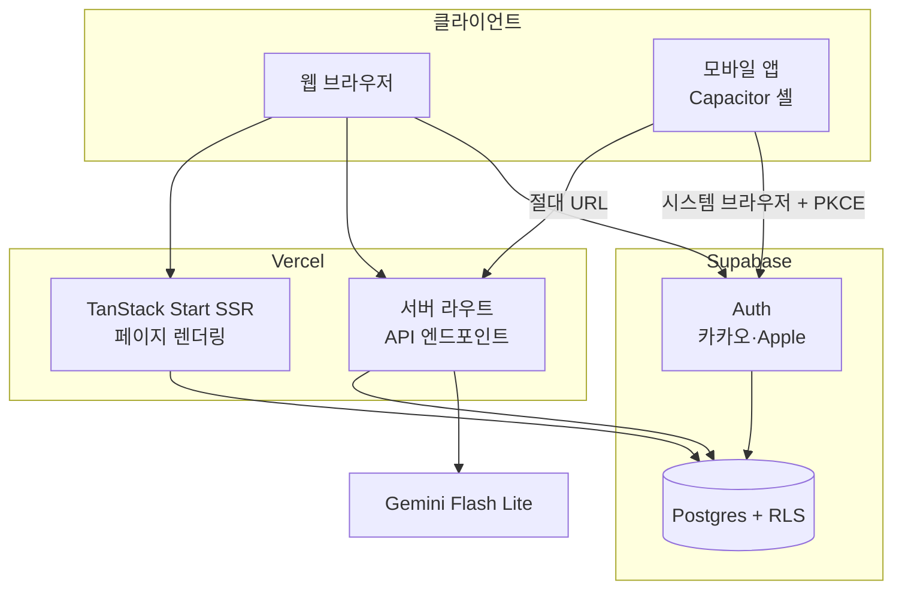
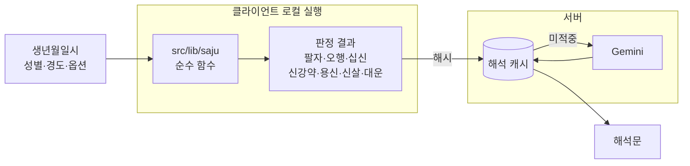
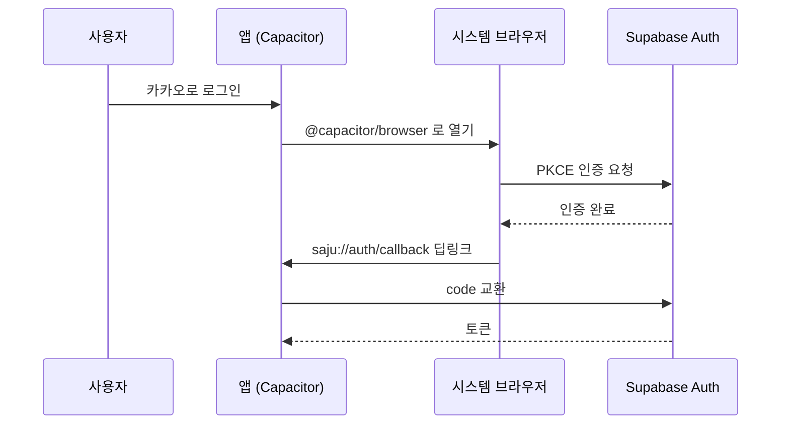

# 02. 아키텍처

> ADR 의 결정을 하나의 그림으로 합친 문서다.
> 각 결정의 근거는 [adr/](adr/) 을 참조한다.

## 1. 전체 구조



핵심은 사주 계산이 이 그림에 없다는 점이다.
계산은 클라이언트 안에서 끝나므로 서버를 거치지 않는다.

## 2. 계산과 해석의 분리

이 프로젝트에서 가장 중요한 경계다.



지켜야 하는 것은 두 가지다.

- 계산과 판정은 `apps/web/src/lib/saju` 의 순수 함수만 한다.
- LLM 프롬프트에는 판정 결과만 들어간다. 생년월일시 원본은 넣지 않는다.

원본을 넣으면 LLM 이 재계산할 여지가 생기고, 그 순간 결과의 재현성이 무너진다.
근거는 [ADR 0005](adr/0005-rule-engine-plus-llm-interpretation.md) 에 있다.

## 3. 빌드 타깃

같은 소스에서 두 가지를 뽑는다([ADR 0003](adr/0003-spa-bundle-for-app.md)).

| 타깃 | 빌드 | 배포처 | API 호출 |
| ---- | ---- | ------ | -------- |
| 웹 | TanStack Start SSR | Vercel | 상대 경로 |
| 앱 | 클라이언트 전용 SPA | Capacitor 번들 | 배포된 웹의 절대 URL |

앱은 `capacitor://localhost` 오리진에서 뜨므로 상대 경로 호출이 서버로 나가지 않는다.
그래서 서버 호출을 명시적 API 라우트로 통일하고 base URL 을 빌드 시점에 주입한다
([ADR 0004](adr/0004-api-routes-over-server-functions.md)).

TanStack Start 를 클라이언트 전용으로 빌드해 Capacitor `webDir` 에 넣는 경로는 아직 검증되지 않았다.
스캐폴딩 단계의 스파이크 대상이다.

## 4. 디렉토리 구조

```
saju-ai/
├── docs/
│   ├── 00-documentation-guide.md
│   ├── 01-overview.md
│   ├── 02-architecture.md
│   ├── 05-saju-domain-rules.md      도메인 SSOT
│   └── adr/                          0001 ~ 0013
├── apps/
│   ├── web/                          TanStack Start
│   │   └── src/
│   │       ├── routes/               페이지와 API 라우트
│   │       ├── lib/saju/             계산 엔진 (외부 의존 0)
│   │       │   └── fixtures/         검증 케이스
│   │       ├── server/               Supabase 접근, LLM 공급자
│   │       └── components/
│   └── mobile/                       Capacitor 셸
│       ├── ios/
│       └── android/
├── package.json
└── pnpm-workspace.yaml
```

`packages/` 공유 패키지를 두지 않는 이유는 계산 엔진의 소비자가 웹 하나뿐이기 때문이다
([ADR 0001](adr/0001-monorepo-pnpm-workspaces.md)).
패키지 경계가 없으므로 엔진의 순수성은 lint 규칙과 훅으로 강제한다
([ADR 0013](adr/0013-saju-engine-purity-enforcement.md)).

## 5. 데이터

| 테이블 | 담는 것 | 접근 정책 |
| ------ | ------- | --------- |
| `saju_profiles` | 이름, 생년월일시, 성별, 경도, 계산 옵션 | RLS. 본인 행만 |
| `share_links` | 랜덤 ID, 대상 프로필, 활성 여부 | RLS 로 본인 관리. 공개 조회는 서버 키로 활성 링크만 |
| `interpretation_cache` | 해시 키, 해석문 | 사용자 식별 정보 없음. 해시로만 조회 |

`saju_profiles` 는 개인정보를 담는다. 처리방침, 수집·이용 동의, 탈퇴 시 파기 절차가 따라온다.

`interpretation_cache` 는 개인정보가 아니다.
키가 `sha256(팔자 + 판정 결과 + 계산 옵션 + 프롬프트 버전 + 모델 버전)` 이라 사용자와 연결되지 않는다.
같은 사주를 여러 사람이 조회하면 캐시를 공유한다.

## 6. 인증

웹과 앱의 흐름이 다르다([ADR 0010](adr/0010-supabase-auth-and-db.md)).



앱이 시스템 브라우저를 쓰는 것은 선택이 아니다.
구글은 내장 웹뷰에서 뜬 인증 요청을 `disallowed_useragent` 로 차단한다.

웹은 SSR 세션 쿠키를 쓴다. 앱은 토큰을 쓴다. 두 경로를 모두 다뤄야 한다.

## 7. 기술 스택

| 영역 | 선택 | 근거 |
| ---- | ---- | ---- |
| 웹 프레임워크 | TanStack Start | [ADR 0002](adr/0002-tanstack-start-capacitor-shell.md) |
| 모바일 | Capacitor | [ADR 0002](adr/0002-tanstack-start-capacitor-shell.md) |
| 모노레포 | pnpm workspaces | [ADR 0001](adr/0001-monorepo-pnpm-workspaces.md) |
| 스키마 검증 | Zod | [ADR 0004](adr/0004-api-routes-over-server-functions.md) |
| 인증·DB | Supabase | [ADR 0010](adr/0010-supabase-auth-and-db.md) |
| LLM | Gemini Flash Lite | [ADR 0011](adr/0011-single-prompt-no-streaming.md) |
| 웹 배포 | Vercel | [ADR 0012](adr/0012-vercel-deploy.md) |

## 8. 스캐폴딩 전에 확인할 것

아직 검증되지 않은 가정이 둘 있다. 구현을 시작하기 전에 스파이크로 확인한다.

1. TanStack Start 를 클라이언트 전용 SPA 로 빌드해 Capacitor `webDir` 에 넣을 수 있는가.
   실패하면 [ADR 0003](adr/0003-spa-bundle-for-app.md) 을 대체하는 새 ADR 을 쓴다.
2. Gemini 응답 시간이 Vercel 서버리스 실행시간 제한 안에 들어오는가.
   넘치면 스트리밍이나 백그라운드 생성으로 우회한다
   ([ADR 0011](adr/0011-single-prompt-no-streaming.md)).
